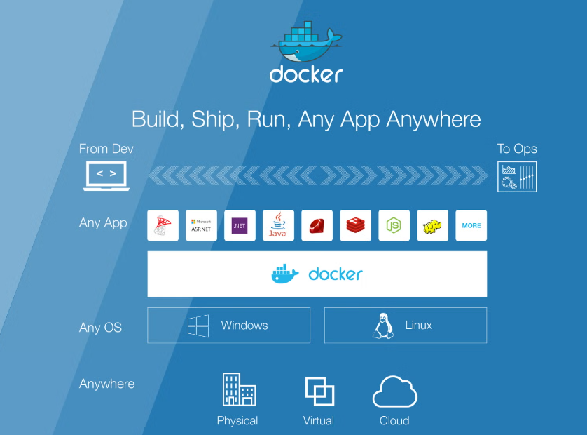
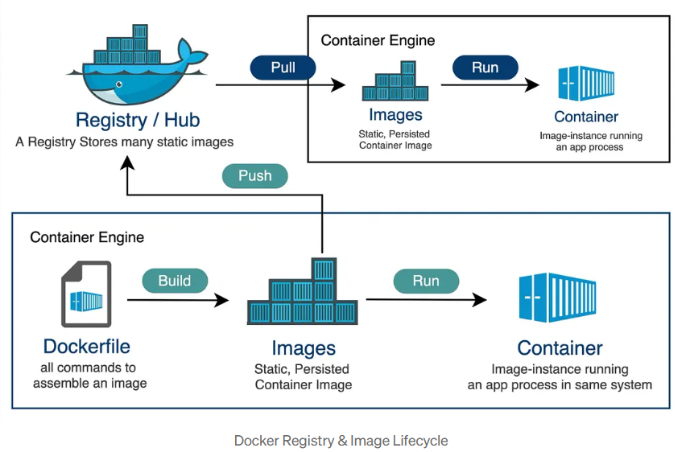
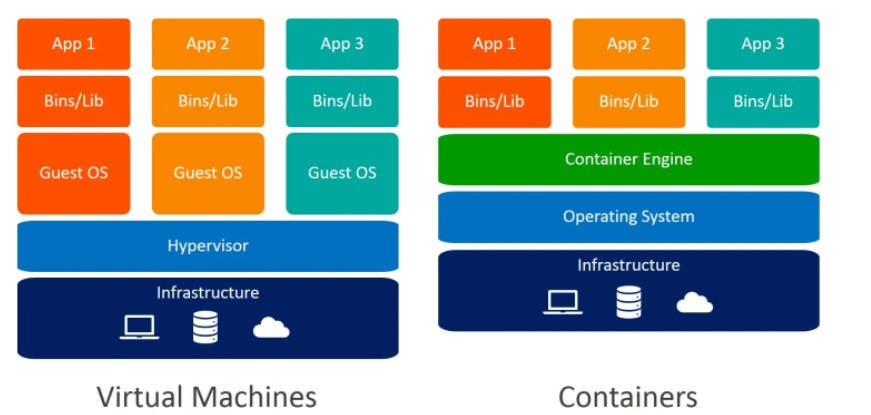

# docker-handbook
A collection of Docker concepts, examples, and hands-on labs covering containerization, image creation, storage, networking, and deployment workflows.

---

A Docker Image is a read-only blueprint that contains the instructions for creating a container, while a Docker Container is a live, running instance of that image



## What is Docker?

- Docker is a containerization platform used to package applications with dependencies

## What is a Container?
- a container is a lightweight, standalone, and executable software package that contains everything needed to run an application: code, runtime, system tools, libraries, and settings

## What is an Image?

- A read-only template used to create containers.
A Docker image is a read-only, lightweight, and standalone executable file that serves as a blueprint for creating Docker containers. It packages together everything needed to run an application—including the code, runtime, system libraries, tools, and settings—ensuring it runs the same way in any environment.

Image Lifecycle Flow:

```text
Dockerfile
   ↓
Build Image (local)
   ↓
Tag Image
   ↓
Push → Registry (Docker Hub)
   ↓
Pull (server / Kubernetes)
   ↓
Run Container
```

## What is a Docker Registry?

- A Docker Registry is a centralized storage system for Docker images.

```text
Public registry → Docker Hub
Private registry → your company server (AWS ECR, GCR, etc.)
```
Examples:

- Docker Hub
- AWS ECR
- GitHub Container Registry
- GitLab Registry

Think:

```Registry = Image storage (like GitHub for code)```




## Difference between VM and Docker?

```VM includes full OS; Docker shares host OS kernel and is lightweight.```




## Docker LifeCycle

There are three important things,

- docker build -> builds docker images from Dockerfile
- docker run -> runs container from docker images
- docker push -> push the container image to public/private regestries to share the docker images.


## Most Important Understanding
Docker Image = Saved packaged application

Docker Container = Running application from image


Dockerfile → Builds → Image
Image → Runs → Container


| Image | Container |
|---|---|
| Blueprint | Running app |
| Static | Dynamic |
| Read-only | Executable |
| Template	| Instance |

---

# Important Docker Concepts Learned

## Docker Image

- Blueprint/template
- Created using docker build

---

## Docker Container

- Running instance of image
- Created using docker run

---

## docker run vs docker start

| Command | Purpose |
|---|---|
| docker run | Creates NEW container |
| docker start | Starts EXISTING container |

---

## docker ps vs docker ps -a

| Command | Purpose |
|---|---|
| docker ps | Running containers |
| docker ps -a | All containers |


---
| Command | Purpose |
|---|---|
| Stop Container | docker stop <container_id> |
| Remove Container | docker rm <container_id> |
| Remove Image | docker rmi myapp |

## Container Persistence Understanding

Learned:
- Running docker run again creates NEW container
- SQLite data not available in new container
- Existing container can be restarted using:

```bash
docker start -a <container_id>
```


---