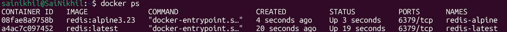
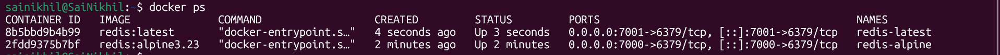

# Docker Port Binding Demonstration Using Multiple Redis Versions

## Objective

This exercise demonstrates:

* Running multiple containers from different versions of the same application.
* Understanding container ports vs host ports.
* Understanding Docker port binding (`-p`).
* Understanding why host ports must be unique.
* Understanding why container ports can be the same.

---

# Step 1 - Pull Redis Images

Verify the Redis images are available locally:

```bash
docker images
```

Example:

```text
redis:latest
redis:alpine3.23
```

---

# Step 2 - Run Containers Without Port Mapping

Run Redis Latest:

```bash
docker run -d --name redis-latest redis:latest
```

Run Redis Alpine:

```bash
docker run -d --name redis-alpine redis:alpine3.23
```

Verify:

```bash
docker ps
```

Output:

```text
CONTAINER ID   IMAGE              PORTS      NAMES
08fae8a9758b   redis:alpine3.23   6379/tcp   redis-alpine
a4ac7c097452   redis:latest       6379/tcp   redis-latest
```

---

# Important Observation

Both Redis containers expose:

```text
6379/tcp
```

This is the default Redis port inside the container.

Since containers have isolated networking, multiple containers can use the same internal port.

---

# Container Port Diagram

```text
redis-latest
      │
      └── 6379

redis-alpine
      │
      └── 6379
```

This is valid because each container has its own network namespace.

---

# Step 3 - Run Container With Port Binding

Run Redis Alpine:

```bash
docker run -d \
-p 7000:6379 \
--name redis-alpine \
redis:alpine3.23
```

Verify:

```bash
docker ps
```

Output:

```text
0.0.0.0:7000->6379/tcp
```

Meaning:

```text
Host Port 7000
       │
       ▼
Container Port 6379
```

---

# Port Binding Diagram

```text
HOST MACHINE

Port 7000
    │
    ▼

redis-alpine
Port 6379
```

---

# Step 4 - Attempt To Reuse Same Host Port

Run:

```bash
docker run -d -p 7000:6379 --name redis-latest redis:latest
```

Error:

```text
Bind for 0.0.0.0:7000 failed:
port is already allocated
```
```
docker: Error response from daemon: failed to set up container networking: driver failed programming external connectivity on endpoint redis-latest (305f214430d42434d4a5e81c07a4816b1624d76e56a9457c2aa37959c8eb8b4e): Bind for 0.0.0.0:7000 failed: port is already allocated
```
---

## Why Did It Fail?

Docker does not allow multiple containers to use the same host port.

The following is invalid:

```text
Host Port 7000
       │
       ├── redis-alpine
       └── redis-latest
```

Docker would not know which container should receive incoming traffic.

---

# Step 5 - Use Different Host Port

Run:

```bash
docker run -d \
-p 7001:6379 \
--name redis-latest \
redis:latest
```

Verify:

```bash
docker ps
```

Output:

```text
redis-alpine   0.0.0.0:7000->6379/tcp
redis-latest   0.0.0.0:7001->6379/tcp
```

---

# Final Architecture

```text
HOST MACHINE

Port 7000
    │
    ▼
redis-alpine
Port 6379


Port 7001
    │
    ▼
redis-latest
Port 6379
```

---

# Key Learning

Container ports can be the same.

Example:

```text
redis-alpine → 6379
redis-latest → 6379
```

This is valid because containers are isolated.

---

# Important Rule

Host ports must be unique.

Valid:

```bash
-p 7000:6379
-p 7001:6379
```

Invalid:

```bash
-p 7000:6379
-p 7000:6379
```

---

# Port Mapping Syntax

```bash
docker run -p <host-port>:<container-port> <image>
```

Example:

```bash
docker run -p 7000:6379 redis
```

Meaning:

```text
Host Port 7000
        │
        ▼
Container Port 6379
```

---

# Final Learning Outcome

* One image can create multiple containers.
* Multiple containers can use the same internal port.
* Host ports must always be unique.
* Port mapping is configured during container creation.
* Docker uses the format:

```text
Host Port : Container Port
```

* Port binding allows applications inside containers to be accessed from the host machine.
