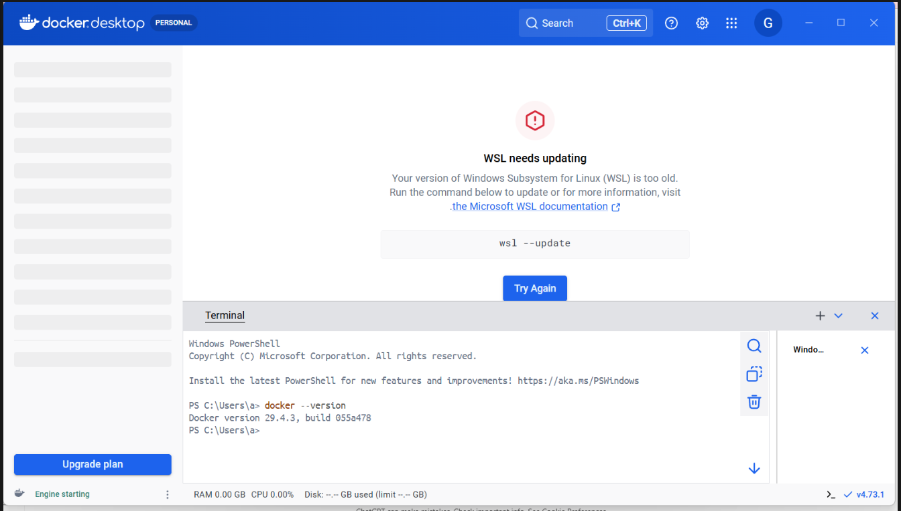
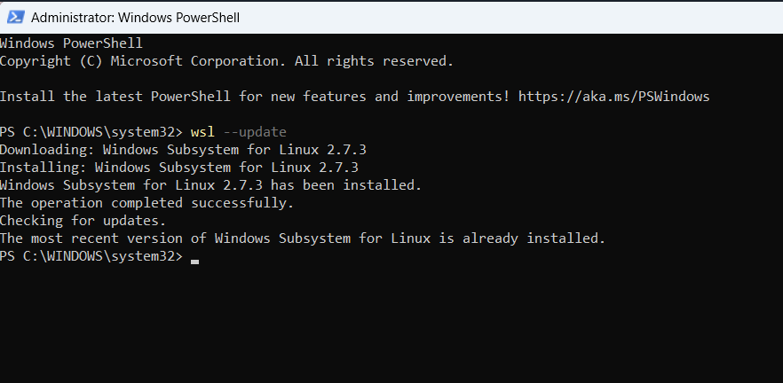

# Django CBV Employee Management System

<details>
<summary>
<h1>Project Overview</h1>
</summary>
A Django Class-Based Views (CBV) CRUD application for managing employee records, containerized using Docker.

This project demonstrates:
- Django CBV architecture
- CRUD operations
- URL routing
- Template rendering
- Docker image creation
- Docker container lifecycle
- Docker Desktop local deployment

---

# Features

- View all employees
- Navigate using clickable employee links
- View detailed employee information
- Create employee records
- Update employee details
- Delete employee records
- Dockerized Django application
- SQLite database

---

# Project Structure

```text
cbvproject/
│
├── cbvproject/
├── testapp/
├── templates/
├── Dockerfile
├── requirements.txt
├── populate.py
├── manage.py
└── README.md
```


---

# URL Endpoints

| Endpoint | Description |
|---|---|
| `/employees/` | Displays clickable employee names |
| `/employees-detailed/` | Displays detailed employee information |
| `/employee/<id>/` | Displays single employee details |
| `/employee/create/` | Create new employee |
| `/employee/update/<id>/` | Update employee details |
| `/employee/delete/<id>/` | Delete employee |
| `/admin/` | Django admin panel |
---

# Application URLs

| Feature | URL |
|---|---|
| Employee List | `http://localhost:8000/employees/` |
| Employee Detailed List | `http://localhost:8000/employees-detailed/` |
| Employee Detail Page | `http://localhost:8000/employee/1/` |
| Create Employee | `http://localhost:8000/employee/create/` |
| Update Employee | `http://localhost:8000/employee/update/1/` |
| Delete Employee | `http://localhost:8000/employee/delete/1/` |
| Django Admin | `http://localhost:8000/admin/` |

---

</details>


<details>
<summary><h1>Docker Desktop Setup and Local Django Containerization Workflow</h1></summary>

## Docker Desktop Setup and Django Containerization

This example demonstrates:
- Installing Docker Desktop on Windows
- Understanding Docker Images and Containers
- Running Docker locally using Docker Desktop
- Containerizing a Django CBV CRUD application
- Running the Django application inside Docker container
- Managing containers and executing commands inside running containers

This setup uses:
- Docker Desktop
- Local Windows machine
- Django project available locally
- SQLite database
- Docker containers running locally

---

## Environment Used

| Component | Value |
|---|---|
| OS | Windows |
| Docker Runtime | Docker Desktop |
| Backend | WSL2 |
| Framework | Django 5 |
| Database | SQLite |
| Python Version | Python 3.11 |

---

## Step 1 - Install Docker Desktop

Downloaded and install:
- Docker Desktop for Windows/mac/linux

During installation:
- Enabled WSL2 backend
- Restarted system if required

---

## Step 2 - Verify Docker Installation

Opened terminal in Docker Desktop and verify Docker installation:

```bash
docker --version
```

---

## Step 3 - Fix WSL Issues

Docker Desktop initially showed:
- Engine starting
- WSL update required





FIX NOW, Open PowerShell AS ADMINISTRATOR
Updated WSL:

```bash
wsl --update
```

Shutdown WSL:

```bash
wsl --shutdown
```

Restart Docker Desktop. Close Docker Desktop completely.

Reopen it

Verified: Botton Left
- ```Engine running``` 
instead of ```Engine starting```

---
## Step 4 -
Then Test Docker Properly

Run:

```docker run hello-world```
What Should Happen?

Docker will:

- Pull hello-world image
- Start container
- Print success message

Example:

```Hello from Docker!```


